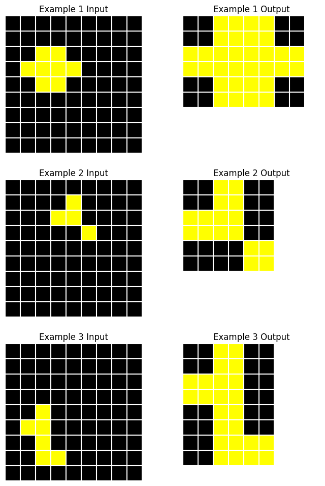

# describe


<!-- WARNING: THIS FILE WAS AUTOGENERATED! DO NOT EDIT! -->

This module implements two different strategies for getting Claude to
generate a description of a given ARC task.

------------------------------------------------------------------------

<a
href="https://github.com/agemoai/arcsolver/blob/main/arcsolver/describe.py#L142"
target="_blank" style="float:right; font-size:smaller">source</a>

### Description

>  Description (content:str, chats:List[claudette.asink.AsyncChat],
>                   method:str)

*A single description of an ARC task.*

The
[`Description`](https://agemoai.github.io/arcsolver/describe.html#description)
class contains the `claudette` chats used to generate the description,
the final response content, and the method used (‘direct’ or ‘indirect’)

------------------------------------------------------------------------

<a
href="https://github.com/agemoai/arcsolver/blob/main/arcsolver/describe.py#L497"
target="_blank" style="float:right; font-size:smaller">source</a>

### DescriptionGenerator

>  DescriptionGenerator (model:str='claude-3-5-sonnet-20241022',
>                            client_type:str='anthropic',
>                            client_kwargs:Optional[Dict]=None,
>                            direct_sp:Optional[str]=None,
>                            indirect_sp:Optional[str]=None,
>                            merge_sp:Optional[str]=None)

*Generates descriptions of ARC tasks using Claude.*

<table>
<colgroup>
<col style="width: 6%" />
<col style="width: 25%" />
<col style="width: 34%" />
<col style="width: 34%" />
</colgroup>
<thead>
<tr>
<th></th>
<th><strong>Type</strong></th>
<th><strong>Default</strong></th>
<th><strong>Details</strong></th>
</tr>
</thead>
<tbody>
<tr>
<td>model</td>
<td>str</td>
<td>claude-3-5-sonnet-20241022</td>
<td>Model identifier (defaults to Sonnet 3.5)</td>
</tr>
<tr>
<td>client_type</td>
<td>str</td>
<td>anthropic</td>
<td>‘anthropic’, ‘bedrock’, or ‘vertex’</td>
</tr>
<tr>
<td>client_kwargs</td>
<td>Optional</td>
<td>None</td>
<td>Optional kwargs for client instantiation</td>
</tr>
<tr>
<td>direct_sp</td>
<td>Optional</td>
<td>None</td>
<td>Custom system prompt for direct description (if None, uses
<code>sp_direct</code>)</td>
</tr>
<tr>
<td>indirect_sp</td>
<td>Optional</td>
<td>None</td>
<td>Custom system prompt for single pair description (if None, uses
<code>sp_indiv</code>)</td>
</tr>
<tr>
<td>merge_sp</td>
<td>Optional</td>
<td>None</td>
<td>Custom system prompt for synthesized description (if None, uses
<code>sp_merge</code>)</td>
</tr>
</tbody>
</table>

## Approach 1: Direct description

The most straightforward approach is to simply provide an image of all
examples in a task and ask for a solution description.

We use a system prompt that explains the objective in detail and
instructs the model to perform chain of thought reasoning before
formulating the final description.

------------------------------------------------------------------------

<a
href="https://github.com/agemoai/arcsolver/blob/main/arcsolver/describe.py#L523"
target="_blank" style="float:right; font-size:smaller">source</a>

### DescriptionGenerator.describe_direct

>  DescriptionGenerator.describe_direct (task:arcsolver.task.ArcTask|str,
>                                            n:int=1, temp:float=0.5,
>                                            prefill:str='<reasoning>',
>                                            **kwargs)

*Generate n direct descriptions of the task concurrently.*

<table>
<colgroup>
<col style="width: 6%" />
<col style="width: 25%" />
<col style="width: 34%" />
<col style="width: 34%" />
</colgroup>
<thead>
<tr>
<th></th>
<th><strong>Type</strong></th>
<th><strong>Default</strong></th>
<th><strong>Details</strong></th>
</tr>
</thead>
<tbody>
<tr>
<td>task</td>
<td>arcsolver.task.ArcTask | str</td>
<td></td>
<td>ARC task or task ID to describe</td>
</tr>
<tr>
<td>n</td>
<td>int</td>
<td>1</td>
<td>No. of descriptions to generate</td>
</tr>
<tr>
<td>temp</td>
<td>float</td>
<td>0.5</td>
<td>Temperature for generation (higher for diversity)</td>
</tr>
<tr>
<td>prefill</td>
<td>str</td>
<td><reasoning></td>
<td>Text to prefill the assistant’s response with</td>
</tr>
<tr>
<td>kwargs</td>
<td></td>
<td></td>
<td></td>
</tr>
<tr>
<td><strong>Returns</strong></td>
<td><strong>List</strong></td>
<td></td>
<td><strong>List of <a
href="https://agemoai.github.io/arcsolver/describe.html#description"><code>Description</code></a>
objects</strong></td>
</tr>
</tbody>
</table>

<br/>Let’s demonstrate with an example task:

    Task: f25fbde4



``` python
describer = DescriptionGenerator(model, 'bedrock')
d_direct = await describer.describe_direct(task)
print(d_direct[0].d)
```

> The input grids contain a pattern of yellow cells on a black
> background forming a continuous path or shape. The output grid is
> determined by finding the rectangular region defined by the extremal
> yellow cells in the input (leftmost, rightmost, topmost, and
> bottommost). In the output, all cells within this rectangular boundary
> are filled with yellow, while maintaining black cells outside this
> region, effectively creating a solid yellow shape that encompasses the
> original pattern’s extent.

This description is nearly right. The wording is strange but it seems to
have correctly identified that the output is the minimal bounding box
around the yellow shape. However, it has not spotted that the yellow
shape has been scaled up in size.

This is a common failure mode for Claude. It often erroneously declares
that two similar shapes are identical. It can often form a rough idea of
what is happening in a task but when faced with multiple similar objects
within grids, it fails to identify and distinguish specific shapes. This
motivates trying an alternative approach.

## Approach 2: Indirect Description

Instead of presenting the entire task—which can sometimes feature 5+
pairs of grids—all at once to Claude, we can instead generate
independent descriptions based on individual pairs of grids and
subsequently ask Claude to synthesize the information contained in the
set of descriptions to form a final unified description.

Pros:

- Larger grids within the image and less whitespace
- Claude can pick out finer details from within the grids
- Can generate highly descriptive summaries of each pair

Cons:

- Many task solutions can not be identified or determined from an
  isolated example pair
- More token-intensive (expensive)

------------------------------------------------------------------------

<a
href="https://github.com/agemoai/arcsolver/blob/main/arcsolver/describe.py#L540"
target="_blank" style="float:right; font-size:smaller">source</a>

### DescriptionGenerator.describe_indirect

>  DescriptionGenerator.describe_indirect (task:arcsolver.task.ArcTask|str,
>                                              n:int=1, temp:float=0.6,
>                                              tools:Optional[list]=None,
>                                              **kwargs)

*Generate n direct descriptions of the task concurrently.*

<table>
<colgroup>
<col style="width: 6%" />
<col style="width: 25%" />
<col style="width: 34%" />
<col style="width: 34%" />
</colgroup>
<thead>
<tr>
<th></th>
<th><strong>Type</strong></th>
<th><strong>Default</strong></th>
<th><strong>Details</strong></th>
</tr>
</thead>
<tbody>
<tr>
<td>task</td>
<td>arcsolver.task.ArcTask | str</td>
<td></td>
<td>ARC task or task ID to describe</td>
</tr>
<tr>
<td>n</td>
<td>int</td>
<td>1</td>
<td>No. of descriptions to generate</td>
</tr>
<tr>
<td>temp</td>
<td>float</td>
<td>0.6</td>
<td>Temperature for generation (higher for diversity)</td>
</tr>
<tr>
<td>tools</td>
<td>Optional</td>
<td>None</td>
<td>List of tools to make available to Claude (defaults to
<code>[ShapeExtractor.extract_shapes]</code>)</td>
</tr>
<tr>
<td>kwargs</td>
<td></td>
<td></td>
<td></td>
</tr>
<tr>
<td><strong>Returns</strong></td>
<td><strong>List</strong></td>
<td></td>
<td><strong>List of <a
href="https://agemoai.github.io/arcsolver/describe.html#description"><code>Description</code></a>
objects</strong></td>
</tr>
</tbody>
</table>

For this approach, we have also implemented tool-use. In order to help
Claude accurately identify shapes, we provide a
[`ShapeExtractor`](https://agemoai.github.io/arcsolver/ocm.html#shapeextractor)
function that can be used

------------------------------------------------------------------------

<a
href="https://github.com/agemoai/arcsolver/blob/main/arcsolver/describe.py#L336"
target="_blank" style="float:right; font-size:smaller">source</a>

### ShapeExtractor.extract_shapes

>  ShapeExtractor.extract_shapes (grid_idx:int, color:str,
>                                     include_diagonal:bool)

*Extract contiguous regions of a specified color from a grid.*

<table>
<colgroup>
<col style="width: 9%" />
<col style="width: 38%" />
<col style="width: 52%" />
</colgroup>
<thead>
<tr>
<th></th>
<th><strong>Type</strong></th>
<th><strong>Details</strong></th>
</tr>
</thead>
<tbody>
<tr>
<td>grid_idx</td>
<td>int</td>
<td>Index of the target grid</td>
</tr>
<tr>
<td>color</td>
<td>str</td>
<td>Color of shapes to extract</td>
</tr>
<tr>
<td>include_diagonal</td>
<td>bool</td>
<td>Consider diagonally adjacent cells as connected?</td>
</tr>
<tr>
<td><strong>Returns</strong></td>
<td><strong>list</strong></td>
<td><strong>List of extracted shapes (boolean arrays) and their
positions</strong></td>
</tr>
</tbody>
</table>

In our system prompt, we instruct Claude to generate an intial
hypothesis about the task solution, and then use the shape extractor
tool to inspect shapes as neccessary to inform its final judgement.
Claude can choose how many times to call the function and which colored
shapes to extract from which grids. Once it has enough information to
form a final description, the conversation ends.

``` python
d_indirect = await describer.describe_indirect(task)
print(d_indirect[0].d)
```

> The input grid is a 9x9 black grid containing yellow pixels arranged
> in various patterns. The transformation converts each yellow pixel in
> the input into a 2x2 block of yellow pixels in the output, while
> maintaining the relative spatial relationships between yellow
> elements. The output grid dimensions are reduced to accommodate the
> transformed pattern while preserving the black background. This
> transformation creates a blocky, enlarged version of the original
> pattern in a smaller grid, with the final dimensions adjusted to fit
> the transformed elements efficiently.

Using this method, it has generated a much more accurate description of
the task. We can inspect the chat history to see its use of the tool:

``` python
print(d_indirect[0].chats[1].h[1]['content'][0].text)
```

    <initial_analysis>
    Based on visual inspection:
    - Input grid shows a sparse diagonal-like pattern of yellow pixels on black background
    - Output grid appears to show a more concentrated arrangement of yellow pixels
    - The output grid is smaller (6x6 vs 9x9)
    - Initial hypothesis: The yellow pixels might be getting "compressed" into a smaller space while maintaining some kind of pattern
    - Key uncertainty: Whether the yellow pixels form a specific connected shape that's being transformed
    - Tool analysis would be helpful to:
      * Verify if the yellow pixels form a connected shape in either grid
      * Count exact number of yellow pixels to see if they're preserved
    </initial_analysis>

    Let me extract the yellow shapes from both grids:

``` python
d_indirect[0].chats[1].h[1]['content'][1]
```

    ToolUseBlock(id='toolu_bdrk_01UsGpZS8zyEW238PbE3tZDg', input={'grid_idx': 2, 'color': 'yellow', 'include_diagonal': True}, name='extract_shapes', type='tool_use')

<div>

> **Warning**
>
> Note that the indirect method is significantly more expensive than the
> direct method. It creates separate chat instances for each pair of
> grids, including an image and triggering a multi-turn tool-calling
> conversation.

</div>

``` python
print(f"Direct cost: ${d_direct[0].cost:.3f}")
print(f"Indirect cost: ${d_indirect[0].cost:.3f}")
```

    Direct cost: $0.012
    Indirect cost: $0.101

------------------------------------------------------------------------

<a
href="https://github.com/agemoai/arcsolver/blob/main/arcsolver/describe.py#L557"
target="_blank" style="float:right; font-size:smaller">source</a>

### DescriptionGenerator.describe_task

>  DescriptionGenerator.describe_task (task:arcsolver.task.ArcTask|str,
>                                          n_direct:int=1, n_indirect:int=1,
>                                          temp:float=0.7, **kwargs)

*Generate multiple descriptions of a task using one or both strategies
concurrently.*

<table>
<colgroup>
<col style="width: 6%" />
<col style="width: 25%" />
<col style="width: 34%" />
<col style="width: 34%" />
</colgroup>
<thead>
<tr>
<th></th>
<th><strong>Type</strong></th>
<th><strong>Default</strong></th>
<th><strong>Details</strong></th>
</tr>
</thead>
<tbody>
<tr>
<td>task</td>
<td>arcsolver.task.ArcTask | str</td>
<td></td>
<td>ARC task or task ID to describe</td>
</tr>
<tr>
<td>n_direct</td>
<td>int</td>
<td>1</td>
<td>No. of direct descriptions to generate</td>
</tr>
<tr>
<td>n_indirect</td>
<td>int</td>
<td>1</td>
<td>No. of indirect descriptions to generate</td>
</tr>
<tr>
<td>temp</td>
<td>float</td>
<td>0.7</td>
<td>Temperature for generation (higher for diversity)</td>
</tr>
<tr>
<td>kwargs</td>
<td></td>
<td></td>
<td></td>
</tr>
<tr>
<td><strong>Returns</strong></td>
<td><strong>List</strong></td>
<td></td>
<td><strong>List of <a
href="https://agemoai.github.io/arcsolver/describe.html#description"><code>Description</code></a>
objects</strong></td>
</tr>
</tbody>
</table>

This method allows us to generate descriptions using either or both
strategies at the same time.
