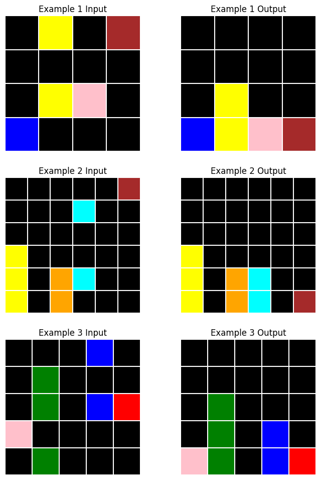
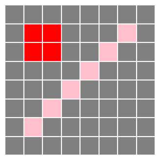

# arcsolver


<!-- WARNING: THIS FILE WAS AUTOGENERATED! DO NOT EDIT! -->

This library contains tools for visualizing, analyzing and solving tasks
from the Abstraction and Reasoning Corpus (ARC) challenge dataset.

As this library was built using
[`nbdev`](https://github.com/AnswerDotAI/claudette.git), the source code
can be found in the jupyter notebooks directory
([nbs](https://github.com/agemoai/arcsolver/tree/main/nbs)).

Full documentation available at https://agemoai.github.io/arcsolver.

## Installation

1.  Install `claudette` from its GitHub
    [repository](https://github.com/AnswerDotAI/claudette) (PyPi version
    is a bit behind):

``` sh
$ pip install git+https://github.com/AnswerDotAI/claudette.git@5ea3a59
```

2.  Install `arcsolver`:

``` sh
$ pip install arcsolver
```

<div>

> **Note**
>
> To use the automated description or solution generation features of
> this library, access to Anthropic’s Claude Sonnet 3.5 model is
> required. Set the `ANTHROPIC_API_KEY` environment variable or
> configure appropriate credentials for AWS bedrock or Google Vertex.

</div>

## Key Features

- **Task Management:** Load and visualize ARC tasks with the
  [`ArcTask`](https://agemoai.github.io/arcsolver/task.html#arctask)
  class
- **Object-Centric Modelling:** A set of primitive classes for
  representing grid objects and transformations
- **LLM Integration:** Designed to use Claude Sonnet 3.5 for automated
  task analysis and solution generation
- **Extensible Architecture:** Easy to add new primitives and helper
  functions to enhance solving capabilities

## Quick Start

### Task Representation

The `task` module provides classes for working with ARC tasks

``` python
from arcsolver.task import ArcGrid, ArcPair, ArcTask

task = ArcTask('1e0a9b12'); task.plot()
```



An [`ArcTask`](https://agemoai.github.io/arcsolver/task.html#arctask)
comprises a list of input-output example
[`ArcPair`](https://agemoai.github.io/arcsolver/task.html#arcpair)s,
each of which holds two
[`ArcGrid`](https://agemoai.github.io/arcsolver/task.html#arcgrid)s.
Each class has convenient `plot` methods for visualization or directly
outputting to binary strings that can be passed to Claude.

``` python
print(f"Input grid 1 plot: {task.train[0].input.plot(to_base64=True)[:20]}...")
```

    Input grid 1 plot: b'\x89PNG\r\n\x1a\n\x00\x00\x00\rIHDR\x00\x00\x01H'...

### Object-centric Models

The `ocm` module provides a set of primitive classes for constructing
object-centric models of ARC grids. For example:

``` python
from arcsolver.ocm import Vector, Rectangle, Line, Grid, Color, Direction

grid = Grid(
    size=Vector(8,8),
    background_color=Color('grey'),
    objects=[
        Rectangle(position=Vector(1,1), size=Vector(2,2), color=Color('red')),
        Line(position=Vector(6,1), direction=Direction.NE, length=6, color=Color('pink'))
    ]
)
ArcGrid(grid.to_array()).plot()
```



### Task Descriptions

Use Claude to analyze and describe ARC tasks

``` python
from arcsolver.describe import DescriptionGenerator

describer = DescriptionGenerator()
d = await describer.describe_task(task, 1); print(d[0].d)
```

> The input grids contain various colored squares arranged on a black
> background in different positions. In the transformation, all colored
> squares “fall” vertically to the bottom row while maintaining their
> relative horizontal positions and original colors. The rest of the
> grid becomes filled with black squares, resulting in an output where
> all non-black squares are aligned in the bottom row, preserving their
> left-to-right ordering from the input grid.

<div>

> **Warning**
>
> Depending on the task and the description strategy used (see
> [docs](https://agemoai.github.io/arcsolver/describe.html)),
> [`DescriptionGenerator`](https://agemoai.github.io/arcsolver/describe.html#descriptiongenerator)
> may decompose the task into multiple images, resulting in a
> token-intensive prompt (~$0.10 using Sonnet 3.5).

</div>

### Solution Generation

Use Claude to construct a solution to an ARC task, automatically
refining its attempts based on execution and prediction error feedback.

``` python
from arcsolver.solve import ArcSolver

solver = ArcSolver()
solutions = await solver.solve(task)
```


    Solving task: 1e0a9b12
    Generating descriptions... | Attempts: 0/30 | Best Score: 0.000 | Cost: $0.000
    Starting solution attempts... | Attempts: 0/30 | Best Score: 0.000 | Cost: $0.142
    Generating initial solutions... | Attempts: 0/30 | Best Score: 0.000 | Cost: $0.142
    Testing solutions... | Attempts: 0/30 | Best Score: 0.000 | Cost: $0.231
    Continuing refinement... | Attempts: 2/30 | Best Score: 0.866 | Cost: $0.231
    Refining previous solutions... | Attempts: 2/30 | Best Score: 0.866 | Cost: $0.231
    Testing solutions... | Attempts: 2/30 | Best Score: 0.866 | Cost: $0.332
    Continuing refinement... | Attempts: 4/30 | Best Score: 0.904 | Cost: $0.332
    Refining previous solutions... | Attempts: 4/30 | Best Score: 0.904 | Cost: $0.332
    Testing solutions... | Attempts: 4/30 | Best Score: 0.904 | Cost: $0.424
    Continuing refinement... | Attempts: 6/30 | Best Score: 0.951 | Cost: $0.424
    Refining previous solutions... | Attempts: 6/30 | Best Score: 0.951 | Cost: $0.424
    Testing solutions... | Attempts: 6/30 | Best Score: 0.951 | Cost: $0.528
    Continuing refinement... | Attempts: 8/30 | Best Score: 0.951 | Cost: $0.528
    Refining previous solutions... | Attempts: 8/30 | Best Score: 0.951 | Cost: $0.528
    Testing solutions... | Attempts: 8/30 | Best Score: 0.951 | Cost: $0.633
    Continuing refinement... | Attempts: 10/30 | Best Score: 0.958 | Cost: $0.633
    Refining previous solutions... | Attempts: 10/30 | Best Score: 0.958 | Cost: $0.633
    Testing solutions... | Attempts: 10/30 | Best Score: 0.958 | Cost: $0.732
    Continuing refinement... | Attempts: 12/30 | Best Score: 0.965 | Cost: $0.732
    Refining previous solutions... | Attempts: 12/30 | Best Score: 0.965 | Cost: $0.732
    Testing solutions... | Attempts: 12/30 | Best Score: 0.965 | Cost: $0.835
    Found potential solution, validating... | Attempts: 12/30 | Best Score: 1.000 | Cost: $0.835
    Solution found! | Attempts: 14/30 | Best Score: 1.000 | Cost: $0.835
    Solution found! 🎉 | Attempts: 14/30 | Best Score: 1.000 | Cost: $0.835

## Contributing

Contributions are welcome! Refined prompts, new OCM primitives, expanded
tool-use, alternative retry strategy…

Feel free to raise an issue or submit a PR.

### Learn More

To read about the motivation for building this tool, check out our
[blog](https://agemo.ai/resources/summer-of-arc-agi) and watch out for
future posts
