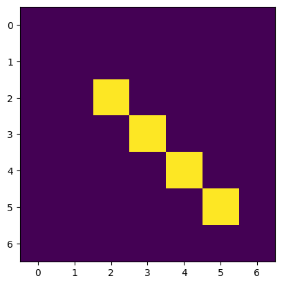
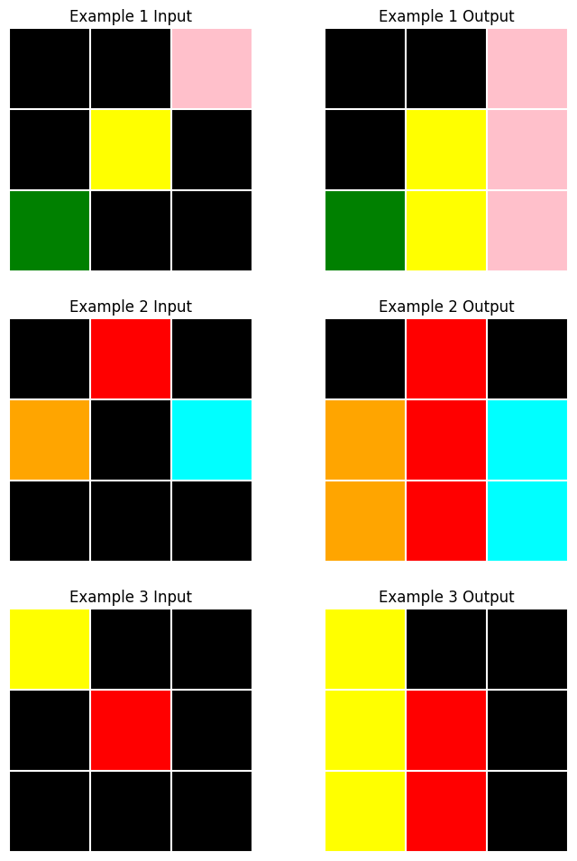
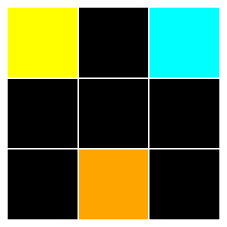
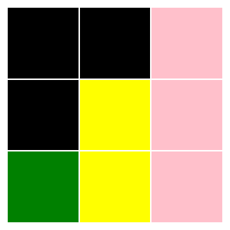
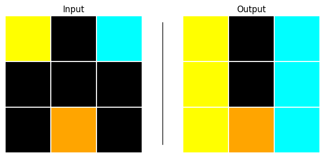

# ocm


<!-- WARNING: THIS FILE WAS AUTOGENERATED! DO NOT EDIT! -->

An ARC task can be described using an input grid model and an output
grid model.

- The input OCM describes the variant and invariant properties of valid
  grids for a given task
  - e.g. the input grid size, the presence of certain distinct colored
    shapes/patterns, etc.
- The output OCM describes how the properties and objects of an output
  grid are derived/constructed based on an input grid and the objects
  contained therein.

## Properties

First we will define a few classes for declaring properties of grids and
their objects

------------------------------------------------------------------------

<a
href="https://github.com/agemoai/arcsolver/blob/main/arcsolver/ocm.py#L18"
target="_blank" style="float:right; font-size:smaller">source</a>

### Vector

>  Vector (i:int, j:int)

*2D vector for positions, sizes, and directions.*

We will use a
[`Vector`](https://agemoai.github.io/arcsolver/ocm.html#vector) class
for specifying positions etc. in ARC grids. Positions are denoted as an
(`i`, `j`) coordinate with respect to the top-left corner of an ARC
grid.

``` python
Vector(0,0)
```

    Vector(i=0, j=0)

Addition, subtraction and scalar multiplication are supported

``` python
test_eq(Vector(2,2), Vector(1,1) + Vector(1,1))
test_eq(Vector(6,2), 2*Vector(3,1))
test_ne(Vector(2,3), Vector(3,2))
```

The `to_array` method returns a numpy array

``` python
Vector(i=3, j=7).to_array()
```

    array([3, 7])

There is also a `from_array` class method, though unpacking is more
concise

``` python
test_eq(
    Vector.from_array(np.array([1,2])), 
    Vector(*np.array([1,2]))
)
```

------------------------------------------------------------------------

<a
href="https://github.com/agemoai/arcsolver/blob/main/arcsolver/ocm.py#L44"
target="_blank" style="float:right; font-size:smaller">source</a>

### Color

>  Color (value:Union[int,str])

*Represents a color using an integer value (0-9) or a color name.*

There are 10 colors in ARC grids:

``` python
print(Color.colors)
```

    ['black', 'blue', 'red', 'green', 'yellow', 'grey', 'pink', 'orange', 'cyan', 'brown']

The [`Color`](https://agemoai.github.io/arcsolver/ocm.html#color) class
holds the mapping, allowing us to instantiate color properties using
either the name or integer value

``` python
Color('blue')
```

    Color('blue', value=1)

``` python
test_eq(Color('green'), Color(3))
```

------------------------------------------------------------------------

<a
href="https://github.com/agemoai/arcsolver/blob/main/arcsolver/ocm.py#L61"
target="_blank" style="float:right; font-size:smaller">source</a>

### Direction

>  Direction (value, names=None, module=None, qualname=None, type=None,
>                 start=1)

*Represents cardinal and intercardinal directions as 2D vectors.*

With
[`Direction`](https://agemoai.github.io/arcsolver/ocm.html#direction),
we can describe objects such as a line by their start position, length
and direction.

``` python
Direction.UP.value
```

    Vector(i=-1, j=0)

## Objects

The core primitive in ARC tasks is the concept of an
[`Object`](https://agemoai.github.io/arcsolver/ocm.html#object), located
at a `position` somewhere in the grid. We will define specific classes
for different shapes that will each inherit from this base clase.

------------------------------------------------------------------------

<a
href="https://github.com/agemoai/arcsolver/blob/main/arcsolver/ocm.py#L82"
target="_blank" style="float:right; font-size:smaller">source</a>

### Object

>  Object (position:__main__.Vector)

*Base class for shape objects in ARC tasks.*

------------------------------------------------------------------------

<a
href="https://github.com/agemoai/arcsolver/blob/main/arcsolver/ocm.py#L91"
target="_blank" style="float:right; font-size:smaller">source</a>

### Rectangle

>  Rectangle (position:__main__.Vector, size:__main__.Vector,
>                 color:__main__.Color)

*Rectangular shape.*

The simplest object is a
[`Rectangle`](https://agemoai.github.io/arcsolver/ocm.html#rectangle),
which represents any contiguous rectangular sub-array within the grid. A
singleton cell is just a
[`Rectangle`](https://agemoai.github.io/arcsolver/ocm.html#rectangle) of
size `Vector(1,1)`

We give each specific shape a `_get_shape_array` private method for
converting it into a numpy array, e.g.:

``` python
rec = Rectangle(position=Vector(0,0), size=Vector(3,3), color=Color('red'))
rec._get_shape_array()
```

    array([[2, 2, 2],
           [2, 2, 2],
           [2, 2, 2]])

------------------------------------------------------------------------

<a
href="https://github.com/agemoai/arcsolver/blob/main/arcsolver/ocm.py#L100"
target="_blank" style="float:right; font-size:smaller">source</a>

### Line

>  Line (position:__main__.Vector, direction:__main__.Direction,
>            length:typing.Annotated[int,Gt(gt=0)], color:__main__.Color)

*Line shape.*

ARC grids often feature straight line objects; e.g. spanning the grid,
connecting more complex shapes, etc. To allow us to capture both
horizontal/vertical and diagonal lines, we’ll create a new primitive.

For diagonal lines, the `_get_shape_array` method will return a 2d array
with the color value along the appropriate diagonal and `-1` elsewhere

``` python
l = Line(position=Vector(5,5), direction=Direction.NW, length=4, color=Color(3))
l._get_shape_array()
```

    array([[ 3, -1, -1, -1],
           [-1,  3, -1, -1],
           [-1, -1,  3, -1],
           [-1, -1, -1,  3]])

Note that the position of an object in the grid always refers to its
top-left corner. For an orthogonal line with direction `UP` or `LEFT`,
or for diagonal lines with direction `NW`, `NE` or `SW`, we will need to
subtract an offset to determine the object’s correct position.

``` python
l.offset
```

    Vector(i=-3, j=-3)

------------------------------------------------------------------------

<a
href="https://github.com/agemoai/arcsolver/blob/main/arcsolver/ocm.py#L132"
target="_blank" style="float:right; font-size:smaller">source</a>

### Bitmap

>  Bitmap (position:__main__.Vector, data:numpy.ndarray)

*Multi-colored bitmap pattern.*

The [`Bitmap`](https://agemoai.github.io/arcsolver/ocm.html#bitmap)
object represents more complex shapes and patterns, including
multi-colored patterns.

``` python
b = Bitmap(position=Vector(2,3), data=np.array([[3,0],[3,3],[0,3]])); b
```

    Bitmap(position=Vector(i=2, j=3), data=array([[3, 0],
           [3, 3],
           [0, 3]]))

We can now define a general `to_array` method for all objects

------------------------------------------------------------------------

<a
href="https://github.com/agemoai/arcsolver/blob/main/arcsolver/ocm.py#L157"
target="_blank" style="float:right; font-size:smaller">source</a>

### Object.to_array

>  Object.to_array (grid_size:Optional[__main__.Vector]=None)

*If grid_size is provided, returns the object positioned within a grid
of that size. If grid_size is None, returns just the object’s array.*

Let’s check the
[`Line`](https://agemoai.github.io/arcsolver/ocm.html#line) object we
created. For now, we’ll just use matplotlib’s `imshow` to visualise the
array

It’s a line of length 4, starting at (5,5) and extending in a NW
direction.

``` python
l
```

    Line(position=Vector(i=5, j=5), direction=<Direction.NW: Vector(i=-1, j=-1)>, length=4, color=Color('green', value=3))

When we use the `grid_size` argument, it will place the object in the
correct position within a larger array

``` python
plt.imshow(
    l.to_array(grid_size=Vector(7,7))
);
```



## Grid

The final primitive is a container for multiple objects representing a
grid.

------------------------------------------------------------------------

<a
href="https://github.com/agemoai/arcsolver/blob/main/arcsolver/ocm.py#L188"
target="_blank" style="float:right; font-size:smaller">source</a>

### Grid

>  Grid (size:__main__.Vector,
>            background_color:Optional[__main__.Color]=None,
>            objects:List[__main__.Object]=<factory>)

*Grid container with a size, background color, and objects.*

Now we have everything we need to define grid models.

## Example

Let’s define grid models for an ARC task

``` python
t = random.choice(train_tasks)
task = ArcTask(t); task
```

    ArcTask(id='d037b0a7', train_examples=3, test_examples=1)

``` python
task.plot()
```



``` python
task.test[0].input.plot()
```



The input grids are all 3x3 and have a black background, containing at
least one singleton colored cell. It’s simple to define a model for
valid grids in this task:

``` python
class InputModel(Grid):
    size: Literal[Vector(3, 3)]
    background_color: Literal[Color(0)] = Color(0)

    @classmethod
    def from_array(cls, arr: np.ndarray) -> 'InputModel':
        # Find non-black cells
        non_black_positions = np.argwhere(arr != Color(0).value)
        
        return cls(
            size=Vector(*arr.shape),
            objects=[
                Rectangle(position=Vector(i=row, j=col),
                          size=Vector(1,1),
                          color=Color(c))
                for row, col in non_black_positions
                for c in [arr[row, col]]
            ]
        )
```

The `from_array` class method parses an arbitrary numpy array and
creates an instance of this Grid class (assuming that the array is a
valid example of a grid from this task).

We can test that the input model is correctly parsing the grid by
testing if its `to_array` method reconstructs the original array.

``` python
in_grid = InputModel.from_array(task.train[0].input.data)
ArcGrid(data=in_grid.to_array()).plot()
```


``` python
for example in task.train:
    in_arr = example.input.data
    test_eq(in_arr, InputModel.from_array(in_arr).to_array())
```

An output model for this task just needs to construct vertical lines
starting at each colored cell and extending down to the bottom of the
grid.

``` python
class OutputModel(Grid):
    @classmethod
    def from_input(cls, input_grid: InputModel) -> 'OutputModel':
        size = input_grid.size
        # construct vertical lines extending downward from each colored point
        objects = [
            Line(position=o.position, direction=Direction.DOWN, length=3-o.position.i, color=o.color)
            for o in input_grid.objects
        ]

        return cls(
            size=size,
            background_color=input_grid.background_color,
            objects=objects
        )
```

``` python
out_grid = OutputModel.from_input(in_grid)
ArcGrid(out_grid.to_array()).plot()
```



Let’s test it out on the test example

``` python
in_grid_test = InputModel.from_array(
    task.test[0].input.data
)
out_grid_test = OutputModel.from_input(in_grid_test)
```

``` python
ArcPair(
    input_grid=in_grid_test.to_array(),
    output_grid=out_grid_test.to_array()
).plot()
```



Looks good! Let’s double check against the hidden test array

``` python
ArcGrid(task.test[0].output.data) == ArcGrid(out_grid_test.to_array())
```

    True

## Helper Functions

We can define a few helper functions for perfoming common operations in
ARC tasks

------------------------------------------------------------------------

<a
href="https://github.com/agemoai/arcsolver/blob/main/arcsolver/ocm.py#L220"
target="_blank" style="float:right; font-size:smaller">source</a>

### ShapeExtractor

>  ShapeExtractor ()

*Extract distinct “shapes” (i.e. contiguous regions of the same value)
from a numpy array*

During parsing, almost all ARC tasks involve extracting specific shapes.
This helper functions removes the need to implement this logic each
time. It contains various static methods, e.g.:

------------------------------------------------------------------------

<a
href="https://github.com/agemoai/arcsolver/blob/main/arcsolver/ocm.py#L260"
target="_blank" style="float:right; font-size:smaller">source</a>

### ShapeExtractor.extract_all_shapes

>  ShapeExtractor.extract_all_shapes (array:numpy.ndarray,
>                                         include_diagonal:bool=False,
>                                         background_color:Optional[int]=None)

*Extract all shapes of all values from a numpy array.*

<table>
<colgroup>
<col style="width: 6%" />
<col style="width: 25%" />
<col style="width: 34%" />
<col style="width: 34%" />
</colgroup>
<thead>
<tr>
<th></th>
<th><strong>Type</strong></th>
<th><strong>Default</strong></th>
<th><strong>Details</strong></th>
</tr>
</thead>
<tbody>
<tr>
<td>array</td>
<td>ndarray</td>
<td></td>
<td>Numpy array</td>
</tr>
<tr>
<td>include_diagonal</td>
<td>bool</td>
<td>False</td>
<td>Consider diagonally adjacent cells as connected or not</td>
</tr>
<tr>
<td>background_color</td>
<td>Optional</td>
<td>None</td>
<td>Optionally specify a background color to ignore</td>
</tr>
<tr>
<td><strong>Returns</strong></td>
<td><strong>List</strong></td>
<td></td>
<td><strong>List of (sub-array, position, color_value)
tuples</strong></td>
</tr>
</tbody>
</table>

------------------------------------------------------------------------

<a
href="https://github.com/agemoai/arcsolver/blob/main/arcsolver/ocm.py#L274"
target="_blank" style="float:right; font-size:smaller">source</a>

### PatternMatcher

>  PatternMatcher ()

*A class for finding alignments between patterns in numpy arrays.
Supports exact matching and partial matching with missing or extra
elements.*

Often we have extracted a shape (as a subarray) from a grid and we need
to find the positions of other identical shapes within a grid. Another
common situation is that we have a partial shape and we need to align it
with a full version of the shape in a grid. This class allows us to do
that, sliding over the larger array and returning the position that
maximises agreement between the subarray and the area of the larger
array, e.g.:

------------------------------------------------------------------------

<a
href="https://github.com/agemoai/arcsolver/blob/main/arcsolver/ocm.py#L323"
target="_blank" style="float:right; font-size:smaller">source</a>

### PatternMatcher.find_best_match

>  PatternMatcher.find_best_match (target:numpy.ndarray,
>                                      pattern:numpy.ndarray,
>                                      match_type:str='exact')

*Find the best matching position for the pattern in the target.*

<table>
<colgroup>
<col style="width: 6%" />
<col style="width: 25%" />
<col style="width: 34%" />
<col style="width: 34%" />
</colgroup>
<thead>
<tr>
<th></th>
<th><strong>Type</strong></th>
<th><strong>Default</strong></th>
<th><strong>Details</strong></th>
</tr>
</thead>
<tbody>
<tr>
<td>target</td>
<td>ndarray</td>
<td></td>
<td>target array</td>
</tr>
<tr>
<td>pattern</td>
<td>ndarray</td>
<td></td>
<td>the pattern to align</td>
</tr>
<tr>
<td>match_type</td>
<td>str</td>
<td>exact</td>
<td>can be ‘exact’, ‘allow_missing’ or ‘allow_extra’</td>
</tr>
<tr>
<td><strong>Returns</strong></td>
<td><strong>Tuple</strong></td>
<td></td>
<td><strong>tuple of (position, overlap_count)</strong></td>
</tr>
</tbody>
</table>

------------------------------------------------------------------------

<a
href="https://github.com/agemoai/arcsolver/blob/main/arcsolver/ocm.py#L344"
target="_blank" style="float:right; font-size:smaller">source</a>

### EnclosureFiller

>  EnclosureFiller ()

*Fill areas of an array that are “enclosed” by cells of a given value*

------------------------------------------------------------------------

<a
href="https://github.com/agemoai/arcsolver/blob/main/arcsolver/ocm.py#L364"
target="_blank" style="float:right; font-size:smaller">source</a>

### CyclicPattern

>  CyclicPattern (data:numpy.ndarray, period:int,
>                     axis:typing.Annotated[int,Ge(ge=0),Le(le=1)]=0)

*Identify, represent, and manipulate cyclic patterns in ARC task grids,
particularly for tasks involving pattern repetition and extension.*
