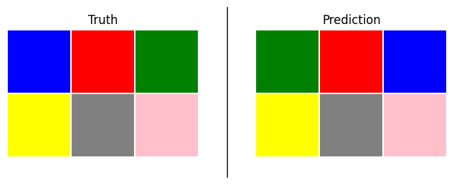
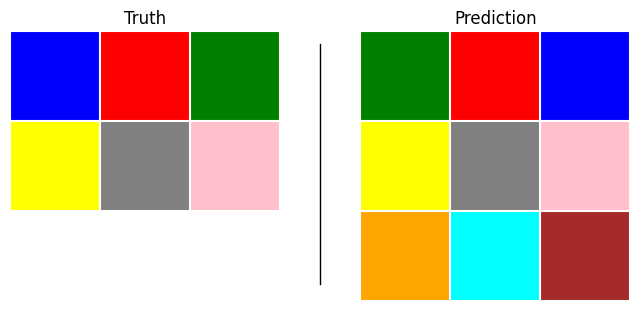
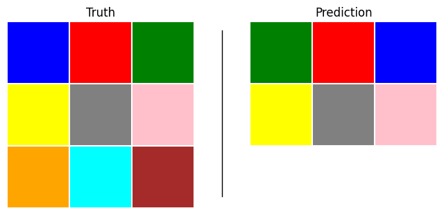

# score


<!-- WARNING: THIS FILE WAS AUTOGENERATED! DO NOT EDIT! -->

We need a way of evaluating predicted ARC grids against the true output
grids.

A simple approach is to calculate the proportion of correct cells.

``` python
def score(
    truth: ArcGrid,  # True ARC grid
    pred: ArcGrid    # Predicted ARC grid
) -> float:
    "Score a predicted grid against the true grid"
    if pred == truth: return 1.0

    return float(np.mean(pred.data == truth.data))
```

``` python
pair = ArcPair(input_grid = np.array([[1,2,3],[4,5,6]]),
               output_grid = np.array([[3,2,1],[4,5,6]]))
```

``` python
pair.plot(titles=['Truth', 'Prediction'])
```



``` python
score(*pair)
```

    0.6666666666666666

Often the predicted grid has the wrong shape. We could simply return
0.0. Instead, let’s pad the grids to be equal shape and assign partial
credit to correctly predicted cells in the overlapping region

------------------------------------------------------------------------

<a
href="https://github.com/agemoai/arcsolver/blob/main/arcsolver/score.py#L13"
target="_blank" style="float:right; font-size:smaller">source</a>

### score

>  score (truth:arcsolver.task.ArcGrid, pred:arcsolver.task.ArcGrid|None)

*Score a predicted grid against the true grid*

<table>
<thead>
<tr>
<th></th>
<th><strong>Type</strong></th>
<th><strong>Details</strong></th>
</tr>
</thead>
<tbody>
<tr>
<td>truth</td>
<td>ArcGrid</td>
<td>True ARC grid</td>
</tr>
<tr>
<td>pred</td>
<td>arcsolver.task.ArcGrid | None</td>
<td>Predicted ARC grid</td>
</tr>
<tr>
<td><strong>Returns</strong></td>
<td><strong>float</strong></td>
<td></td>
</tr>
</tbody>
</table>

<details open class="code-fold">
<summary>Exported source</summary>

``` python
def score(
    truth: ArcGrid,         # True ARC grid
    pred: ArcGrid | None    # Predicted ARC grid
) -> float:
    "Score a predicted grid against the true grid"
    if pred is None: return 0.0
    if pred == truth: return 1.0
    
    # Calculate shape penalty
    rows_ratio = min(truth.shape[0], pred.shape[0]) / max(truth.shape[0], pred.shape[0])
    cols_ratio = min(truth.shape[1], pred.shape[1]) / max(truth.shape[1], pred.shape[1])
    shape_penalty = rows_ratio * cols_ratio

    # Get overlapping region dimensions
    overlap_rows = min(truth.shape[0], pred.shape[0])
    overlap_cols = min(truth.shape[1], pred.shape[1])

    # Calculate color accuracy in overlapping region
    true_overlap = truth.data[:overlap_rows, :overlap_cols]
    pred_overlap = pred.data[:overlap_rows, :overlap_cols]
    color_accuracy = np.mean(true_overlap == pred_overlap)

    return float(shape_penalty * color_accuracy)
```

</details>

``` python
score(*pair)
```

    0.6666666666666666

``` python
pair = ArcPair(input_grid = np.array([[1,2,3],[4,5,6]]),
               output_grid = np.array([[3,2,1],[4,5,6], [7,8,9]]))
pair.plot(titles=['Truth', 'Prediction'])
```



``` python
score(*pair)
```

    0.4444444444444444

``` python
pair = ArcPair(input_grid = np.array([[1,2,3],[4,5,6],[7,8,9]]),
               output_grid = np.array([[3,2,1],[4,5,6]]))
pair.plot(titles=['Truth', 'Prediction'])
```



``` python
score(*pair)
```

    0.4444444444444444
