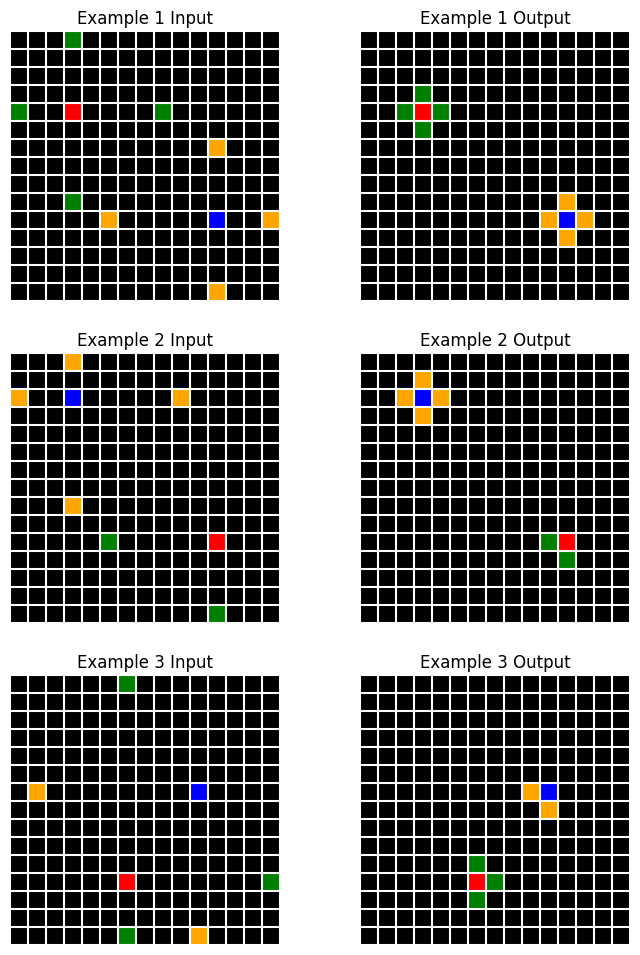
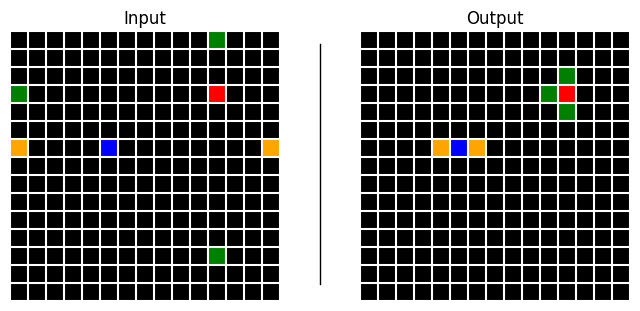

# solve


<!-- WARNING: THIS FILE WAS AUTOGENERATED! DO NOT EDIT! -->

This module implements a solver agent that generates, validates and
tests candidate solutions to a given task, then iteratively attempts to
refine its solutions based on execution and prediction error feedback.
The solver carries out the following process:

1.  Analyse the task and generate `n` descriptions concurrently (using
    the direct or indirect method or a combination)
2.  Based on these, generate `n` candidate solutions concurrently using
    the OCM framework
    - During generation, solutions are automatically parsed and
      validated for syntax errors
3.  In isolated python subprocesses, run all solutions against the task
    data in parallel, constructing output grid predictions
4.  Calculate scores for all solutions based on cell-wise accuracy
5.  If any solutions correctly predict all train examples:
    - Validate against the test example and return if successful
6.  Else:
    - Construct a feedback prompt for Claude, including any execution
      errors and an image of the true vs predicted grids
7.  Repeat up to a max number of attempts

------------------------------------------------------------------------

<a
href="https://github.com/agemoai/arcsolver/blob/main/arcsolver/solve.py#L134"
target="_blank" style="float:right; font-size:smaller">source</a>

### Solution

>  Solution (reasoning:str, new_primitives:str, input_model:str,
>                output_model:str)

*Code components of a single ARC solution attempt.*

We use a system prompt that instructs Claude to respond with chain of
thought reasoning, followed by its solution code, formatted using xml
tags: <new_primitives> for proposed new OCM primitives for solving this
and other ARC tasks, <input_model> for the input grid model and
<output_model> for the output grid model. The
[`Solution`](https://agemoai.github.io/arcsolver/solve.html#solution)
dataclass automatically parses the xml response and stores the various
components.

This class will throw an exception if the xml parsing fails. We can also
parse the generated code to check for syntax errors.

Before running the code, we can use `ast` to validate that it contains
the correct model names, class methods etc. and doesn’t raise syntax
errors.

------------------------------------------------------------------------

<a
href="https://github.com/agemoai/arcsolver/blob/main/arcsolver/solve.py#L166"
target="_blank" style="float:right; font-size:smaller">source</a>

### CodeValidator

>  CodeValidator ()

*Validates that ARC solution code has required classes and methods*

Let’s test it out. To encourage the correct code format, we’ll insert a
few examples into the chat history.

``` python
chat = _create_chat(model, _create_client('bedrock', {}), sp=sp_solve)
for e in examples:
    chat.h.append(e.description)
    chat.h.append((f"<reasoning>\n{e.reasoning}\n</reasoning>\n\n<new_primitives>\n{e.new_primitives}\n"
                   f"</new_primitives>\n\n<input_model>\n{e.input_model}\n</input_model>\n\n"
                   f"<output_model>\n{e.output_model}\n</output_model>"))

r = await chat(
    ds[0].d,
    prefill="<reasoning>", temp=0.6, stop='</output_model>'
)
if r.stop_reason == 'stop_sequence': r.content[0].text += '</output_model>'
```

``` python
sol = Solution.from_response(r.content[0].text)
CodeValidator.validate(sol.full_code)
print(sol.input_model)
```

    class InputModel(Grid):
        """
        Model for input grid containing scattered colored pixels.
        """
        pixel_positions: Dict[int, List[Vector]] = Field(default_factory=dict)
        
        @classmethod
        def from_array(cls, arr: np.ndarray) -> 'InputModel':
            positions = {}
            objects = []
            
            # Extract positions of each colored pixel
            for i in range(arr.shape[0]):
                for j in range(arr.shape[1]):
                    if arr[i,j] > 0:
                        color = arr[i,j]
                        if color not in positions:
                            positions[color] = []
                        pos = Vector(i=i, j=j)
                        positions[color].append(pos)
                        objects.append(Rectangle(
                            position=pos,
                            size=Vector(i=1, j=1),
                            color=Color(color)
                        ))
            
            return cls(
                size=Vector(*arr.shape),
                background_color=Color(0),
                pixel_positions=positions,
                objects=objects
            )

In fact, we can run this parsing and validating automatically and
trigger retries if either fails. Let’s patch a new chat method for this

------------------------------------------------------------------------

<a
href="https://github.com/agemoai/arcsolver/blob/main/arcsolver/solve.py#L238"
target="_blank" style="float:right; font-size:smaller">source</a>

### AsyncChat.codeloop

>  AsyncChat.codeloop (pr:str, max_attempts:int=3,
>                          prefill:str='<reasoning>',
>                          stop:str='</output_model>',
>                          trace_func:Optional[<built-infunctioncallable>]=None,
>                          temp=0, maxtok=4096, stream=False)

*Generate and validate solution code from Claude, automatically retrying
on validation errors*

<table>
<colgroup>
<col style="width: 6%" />
<col style="width: 25%" />
<col style="width: 34%" />
<col style="width: 34%" />
</colgroup>
<thead>
<tr>
<th></th>
<th><strong>Type</strong></th>
<th><strong>Default</strong></th>
<th><strong>Details</strong></th>
</tr>
</thead>
<tbody>
<tr>
<td>pr</td>
<td>str</td>
<td></td>
<td>Initial prompt to pass to Claude</td>
</tr>
<tr>
<td>max_attempts</td>
<td>int</td>
<td>3</td>
<td>Maximum number of retry attempts</td>
</tr>
<tr>
<td>prefill</td>
<td>str</td>
<td><reasoning></td>
<td>Text to prefill assistant’s response with</td>
</tr>
<tr>
<td>stop</td>
<td>str</td>
<td></output_model></td>
<td>Stop sequence for generation</td>
</tr>
<tr>
<td>trace_func</td>
<td>Optional</td>
<td>None</td>
<td>Function to trace attempts (e.g. print)</td>
</tr>
<tr>
<td>temp</td>
<td>int</td>
<td>0</td>
<td>Temperature</td>
</tr>
<tr>
<td>maxtok</td>
<td>int</td>
<td>4096</td>
<td>Maximum tokens</td>
</tr>
<tr>
<td>stream</td>
<td>bool</td>
<td>False</td>
<td>Stream response?</td>
</tr>
<tr>
<td><strong>Returns</strong></td>
<td><strong>Solution</strong></td>
<td></td>
<td><strong>Validated solution attempt from Claude’s
response</strong></td>
</tr>
</tbody>
</table>

------------------------------------------------------------------------

<a
href="https://github.com/agemoai/arcsolver/blob/main/arcsolver/solve.py#L289"
target="_blank" style="float:right; font-size:smaller">source</a>

### Attempt

>  Attempt (task:arcsolver.task.ArcTask,
>               description:arcsolver.describe.Description, depth:int,
>               solution:Optional[__main__.Solution]=None,
>               chat:Optional[claudette.asink.AsyncChat]=None,
>               parent:Optional[ForwardRef('Attempt')]=None,
>               children:List[ForwardRef('Attempt')]=<factory>,
>               result:Optional[__main__.ExecutionResult]=None,
>               error:Optional[str]=None)

*An attempt at solving an ARC task.*

The [`Attempt`](https://agemoai.github.io/arcsolver/solve.html#attempt)
class stores everything relating to a single attempt. The solver will
create a tree structure of attempts, with the root node being a
description. Each subsequent attempt has a `parent` and a list of
`children`, where a child is formed when we retry an attempt using
execution/prediction error feedback.

Next, we need to run the generated code and make predictions on the
training examples. Let’s define a container for a code execution result

------------------------------------------------------------------------

<a
href="https://github.com/agemoai/arcsolver/blob/main/arcsolver/solve.py#L337"
target="_blank" style="float:right; font-size:smaller">source</a>

### ExecutionResult

>  ExecutionResult (in_preds:Optional[List[arcsolver.task.ArcGrid]]=None,
>                       out_preds:Optional[List[arcsolver.task.ArcGrid]]=None,
>                       error:Optional[str]=None,
>                       example_errors:Optional[List[str]]=None)

*Contains all results from a solution attempt execution*

To generate an
[`ExecutionResult`](https://agemoai.github.io/arcsolver/solve.html#executionresult),
we’ll run an
[`Attempt`](https://agemoai.github.io/arcsolver/solve.html#attempt)’s
code in a separate python process.

------------------------------------------------------------------------

<a
href="https://github.com/agemoai/arcsolver/blob/main/arcsolver/solve.py#L345"
target="_blank" style="float:right; font-size:smaller">source</a>

### SandboxedExecutor

>  SandboxedExecutor ()

*Executes ARC solutions in a separate Python process with detailed
results*

<div>

> **Warning**
>
> Note that we are executing code generated by AI models. While designed
> for research and experimentation, it includes basic safety measures:
>
> - Code is pre-validated to check for specifically requested class
>   names and methods.
> - Code execution occurs in isolated subprocesses
> - Each execution has a 5-second timeout limit
> - Exceptions are caught and handled safely
>
> Users should exercise appropriate caution and avoid running unknown
> solutions in security-critical environments.

</div>

We can use `ProcessPoolExecutor` to run all attempts in parallel

------------------------------------------------------------------------

<a
href="https://github.com/agemoai/arcsolver/blob/main/arcsolver/solve.py#L517"
target="_blank" style="float:right; font-size:smaller">source</a>

### ConcurrentExecutor

>  ConcurrentExecutor (max_workers:Optional[int]=None)

*Executes multiple ARC solution attempts concurrently*

If an attempt is unsuccessful, we can write a function to generate a
prompt for Claude to try again. We’ll parse a result and feed back which
predictions were correct, if any and what error messages were
encountered, if any.

------------------------------------------------------------------------

<a
href="https://github.com/agemoai/arcsolver/blob/main/arcsolver/solve.py#L588"
target="_blank" style="float:right; font-size:smaller">source</a>

### feedback

>  feedback (attempt:__main__.Attempt)

*Generate feedback message for Claude based on execution results*

<table>
<colgroup>
<col style="width: 9%" />
<col style="width: 38%" />
<col style="width: 52%" />
</colgroup>
<thead>
<tr>
<th></th>
<th><strong>Type</strong></th>
<th><strong>Details</strong></th>
</tr>
</thead>
<tbody>
<tr>
<td>attempt</td>
<td>Attempt</td>
<td>Incorrect attempt</td>
</tr>
<tr>
<td><strong>Returns</strong></td>
<td><strong>list</strong></td>
<td><strong>feedback prompt for claudette, maybe including an image of
an incorrect prediction</strong></td>
</tr>
</tbody>
</table>

``` python
fb = feedback(attempts[0])
print(fb[0] if len(fb) == 1 else fb[-1])
```

    Well done, your input grid model was able to correctly reconstruct all input arrays.

    Unfortunately, your output model made incorrect predictions for examples 1, 2, 3.

    Attached is an image of the true output grid (left) and your model's prediction (right) for example 3.

    Please try again, responding in the same style as before. Use <reasoning> tags to explain your thought process for addressing these issues, then proceed with <new_primitives>, <input_model> and <output_model>.
    IMPORTANT: Remember the core principles! Do not implement example-specific logic or rules based on this image.

------------------------------------------------------------------------

<a
href="https://github.com/agemoai/arcsolver/blob/main/arcsolver/solve.py#L748"
target="_blank" style="float:right; font-size:smaller">source</a>

### ArcSolver

>  ArcSolver (model:str='claude-3-5-sonnet-20241022',
>                 client_type:str='anthropic',
>                 client_kwargs:Optional[Dict]=None, describer:Optional[arcsolve
>                 r.describe.DescriptionGenerator]=None,
>                 solve_sp:Optional[str]=None, max_workers:Optional[int]=None,
>                 top_n:int=2, logger:Optional[logging.Logger]=None)

*(Attempt to) Solve an ARC task using Claude.*

<table>
<colgroup>
<col style="width: 6%" />
<col style="width: 25%" />
<col style="width: 34%" />
<col style="width: 34%" />
</colgroup>
<thead>
<tr>
<th></th>
<th><strong>Type</strong></th>
<th><strong>Default</strong></th>
<th><strong>Details</strong></th>
</tr>
</thead>
<tbody>
<tr>
<td>model</td>
<td>str</td>
<td>claude-3-5-sonnet-20241022</td>
<td>Model identifier (defaults to Sonnet 3.5)</td>
</tr>
<tr>
<td>client_type</td>
<td>str</td>
<td>anthropic</td>
<td>‘anthropic’, ‘bedrock’, or ‘vertex’</td>
</tr>
<tr>
<td>client_kwargs</td>
<td>Optional</td>
<td>None</td>
<td>Optional kwargs for client instantiation</td>
</tr>
<tr>
<td>describer</td>
<td>Optional</td>
<td>None</td>
<td>Optional custom description generator</td>
</tr>
<tr>
<td>solve_sp</td>
<td>Optional</td>
<td>None</td>
<td>Custom system prompt for solution generation</td>
</tr>
<tr>
<td>max_workers</td>
<td>Optional</td>
<td>None</td>
<td>Max concurrent processes for execution</td>
</tr>
<tr>
<td>top_n</td>
<td>int</td>
<td>2</td>
<td>Number of best attempts to retry from</td>
</tr>
<tr>
<td>logger</td>
<td>Optional</td>
<td>None</td>
<td>Optional pre-configured logger</td>
</tr>
</tbody>
</table>

------------------------------------------------------------------------

<a
href="https://github.com/agemoai/arcsolver/blob/main/arcsolver/solve.py#L832"
target="_blank" style="float:right; font-size:smaller">source</a>

### ArcSolver.solve

>  ArcSolver.solve (task:arcsolver.task.ArcTask|str, d_direct:int=1,
>                       d_indirect:int=1, budget:int=30, temp:float=0.7,
>                       **kwargs)

*Generate and iteratively refine solutions until success or budget
exhausted.*

<table>
<colgroup>
<col style="width: 6%" />
<col style="width: 25%" />
<col style="width: 34%" />
<col style="width: 34%" />
</colgroup>
<thead>
<tr>
<th></th>
<th><strong>Type</strong></th>
<th><strong>Default</strong></th>
<th><strong>Details</strong></th>
</tr>
</thead>
<tbody>
<tr>
<td>task</td>
<td>arcsolver.task.ArcTask | str</td>
<td></td>
<td>ARC task or task ID to solve</td>
</tr>
<tr>
<td>d_direct</td>
<td>int</td>
<td>1</td>
<td>Number of direct descriptions to generate</td>
</tr>
<tr>
<td>d_indirect</td>
<td>int</td>
<td>1</td>
<td>Number of indirect descriptions to generate</td>
</tr>
<tr>
<td>budget</td>
<td>int</td>
<td>30</td>
<td>Maximum number of solution attempts</td>
</tr>
<tr>
<td>temp</td>
<td>float</td>
<td>0.7</td>
<td>Temperature for generation</td>
</tr>
<tr>
<td>kwargs</td>
<td></td>
<td></td>
<td></td>
</tr>
<tr>
<td><strong>Returns</strong></td>
<td><strong>List</strong></td>
<td></td>
<td><strong>Successful solutions found, if any</strong></td>
</tr>
</tbody>
</table>

Let’s try it out on an example task

``` python
t = random.choice(train_tasks)
task = ArcTask(t)
print(f"Task: {t}\n")
task.plot()
```

    Task: ae3edfdc



``` python
solver = ArcSolver(model, 'bedrock', top_n=5)
solutions = await solver.solve(task, d_direct=14, d_indirect=1, budget=50)
```


    Solving task: ae3edfdc
    Generating descriptions... | Attempts: 0/50 | Best Score: 0.000 | Cost: $0.000
    Starting solution attempts... | Attempts: 0/50 | Best Score: 0.000 | Cost: $0.374
    Generating initial solutions... | Attempts: 0/50 | Best Score: 0.000 | Cost: $0.374
    Testing solutions... | Attempts: 0/50 | Best Score: 0.000 | Cost: $1.145
    Continuing refinement... | Attempts: 15/50 | Best Score: 0.999 | Cost: $1.145
    Refining previous solutions... | Attempts: 15/50 | Best Score: 0.999 | Cost: $1.145
    Testing solutions... | Attempts: 15/50 | Best Score: 0.999 | Cost: $1.436
    Found potential solution, validating... | Attempts: 15/50 | Best Score: 1.000 | Cost: $1.436
    Solution found! | Attempts: 20/50 | Best Score: 1.000 | Cost: $1.436
    Solution found! 🎉 | Attempts: 20/50 | Best Score: 1.000 | Cost: $1.436

Nice, let’s have a look at the test prediction

``` python
executor = SandboxedExecutor()
test_pred = executor.run(solutions[0].solution, task, split='test')
ArcPair(test_pred.in_preds[0], test_pred.out_preds[0]).plot()
```



And let’s inspect the description that led to a successful solution:

``` python
print(solutions[0].description.d)
```

> The input grids contain scattered colored pixels where red and blue
> pixels serve as attraction points for other colors. Green pixels are
> attracted to and move adjacent to red pixels, while orange pixels are
> attracted to and move adjacent to blue pixels. The positions of red
> and blue pixels remain fixed, while green and orange pixels move to
> become orthogonally adjacent to their respective attractors, forming
> clusters in the output grid. The background black color and grid
> dimensions remain unchanged throughout the transformation.

Pretty good!
