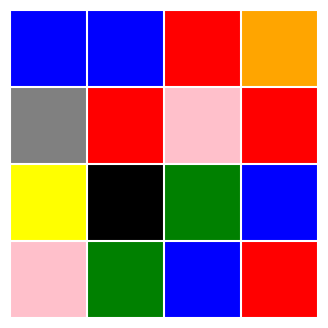
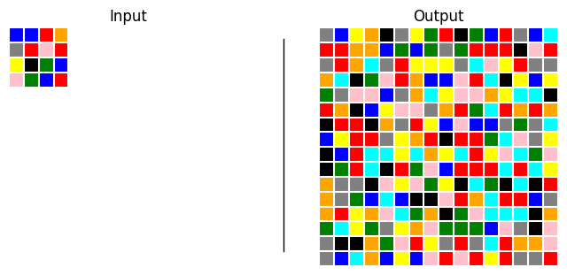
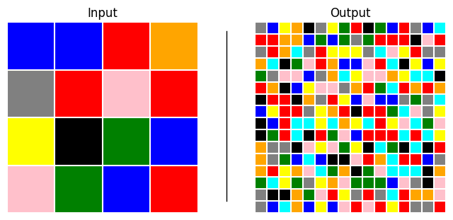
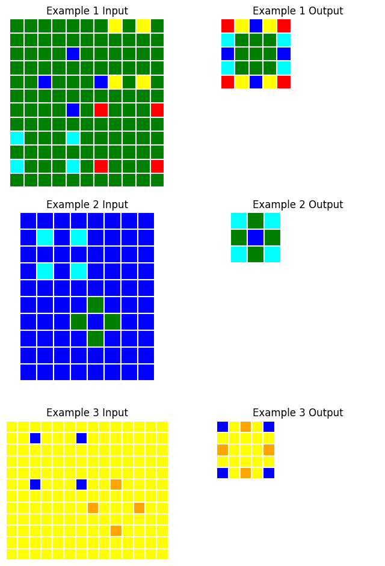
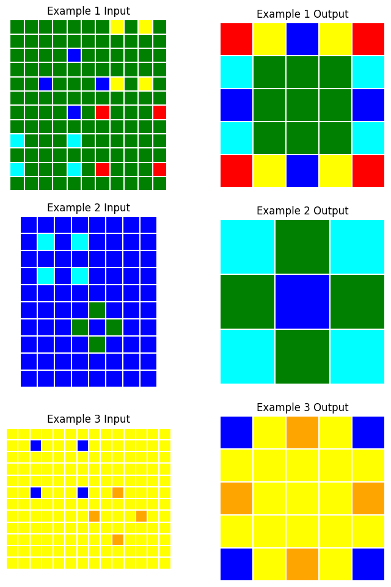

# task


<!-- WARNING: THIS FILE WAS AUTOGENERATED! DO NOT EDIT! -->

------------------------------------------------------------------------

<a
href="https://github.com/agemoai/arcsolver/blob/main/arcsolver/task.py#L23"
target="_blank" style="float:right; font-size:smaller">source</a>

### ArcGrid

>  ArcGrid (data:numpy.ndarray)

*A single ARC grid*

<table>
<thead>
<tr>
<th></th>
<th><strong>Type</strong></th>
<th><strong>Details</strong></th>
</tr>
</thead>
<tbody>
<tr>
<td>data</td>
<td>ndarray</td>
<td>2d array of integers (0–9)</td>
</tr>
</tbody>
</table>

Each ARC task is made up of pairs of input and output “grids”, which are
2-d arrays/matrices of integers

This class stores a single ARC grid as a numpy array. We can then easily
visualise the grid using the `plot()` method

``` python
in_arr = np.random.randint(0,9, (4,4))
in_grid = ArcGrid(in_arr); in_grid
```

    Grid(shape=(4, 4))

``` python
in_grid.plot()
```



The `plot` method also supports returning the base64-encoded string of
the image directly

``` python
print(f"Base64 string: '{in_grid.plot(to_base64=True)[:20]}...'")
```

    Base64 string: 'b'\x89PNG\r\n\x1a\n\x00\x00\x00\rIHDR\x00\x00\x01H'...'

ArcGrids support equality checks, making it easy to test predicted grids

``` python
assert in_grid != ArcGrid(np.ones((3,3), dtype=int))
assert in_grid == ArcGrid(in_arr)
```

------------------------------------------------------------------------

<a
href="https://github.com/agemoai/arcsolver/blob/main/arcsolver/task.py#L122"
target="_blank" style="float:right; font-size:smaller">source</a>

### ArcPair

>  ArcPair (input_grid:__main__.ArcGrid|numpy.ndarray,
>               output_grid:__main__.ArcGrid|numpy.ndarray)

*A pair of ARC grids, typically \[input, output\]. Can also be used for
\[output, prediction\]*

<table>
<thead>
<tr>
<th></th>
<th><strong>Type</strong></th>
<th><strong>Details</strong></th>
</tr>
</thead>
<tbody>
<tr>
<td>input_grid</td>
<td><strong>main</strong>.ArcGrid | numpy.ndarray</td>
<td>Input grid</td>
</tr>
<tr>
<td>output_grid</td>
<td><strong>main</strong>.ArcGrid | numpy.ndarray</td>
<td>Output grid</td>
</tr>
</tbody>
</table>

``` python
out_arr = np.random.randint(0, 9, (16,16))
pair = ArcPair(in_grid, ArcGrid(out_arr))
pair.plot()
```



The output grids in ARC tasks are often a different size to the input
grids. When plotting pairs of grids, we can specify whether we want the
grids to be on the same scale (i.e. one cell is equal size in both
plots) or whether to rescale each grid to fill its half of the plot.

``` python
pair.plot(same_scale=False)
```



------------------------------------------------------------------------

<a
href="https://github.com/agemoai/arcsolver/blob/main/arcsolver/task.py#L214"
target="_blank" style="float:right; font-size:smaller">source</a>

### ArcTask

>  ArcTask (task_id:str, split:str='train',
>               data_dir:str|pathlib.Path|None=None)

*An ARC task*

<table>
<colgroup>
<col style="width: 6%" />
<col style="width: 25%" />
<col style="width: 34%" />
<col style="width: 34%" />
</colgroup>
<thead>
<tr>
<th></th>
<th><strong>Type</strong></th>
<th><strong>Default</strong></th>
<th><strong>Details</strong></th>
</tr>
</thead>
<tbody>
<tr>
<td>task_id</td>
<td>str</td>
<td></td>
<td>8-digit task id</td>
</tr>
<tr>
<td>split</td>
<td>str</td>
<td>train</td>
<td>ARC public dataset split (‘train’ or ‘eval’)</td>
</tr>
<tr>
<td>data_dir</td>
<td>str | pathlib.Path | None</td>
<td>None</td>
<td>Path to ARC data directory (defaults to
<code>'/path/to/arcsolver/arc_data/data'</code>)</td>
</tr>
</tbody>
</table>

``` python
t = [f.split('.')[0] for f in os.listdir('../arcsolver/arc_data/data/training')][1]
task = ArcTask(t); task
```

    ArcTask(id='c8cbb738', train_examples=3, test_examples=1)

An [`ArcTask`](https://agemoai.github.io/arcsolver/task.html#arctask)
stores the training and test examples, each as a list of
[`ArcPair`](https://agemoai.github.io/arcsolver/task.html#arcpair)
objects.

``` python
task.train
```

    [ArcPair(input_shape=(12, 11), output_shape=(5, 5)),
     ArcPair(input_shape=(10, 8), output_shape=(3, 3)),
     ArcPair(input_shape=(12, 14), output_shape=(5, 5))]

``` python
task.plot()
```



Again, we can choose whether to rescale the plots

``` python
task.plot(same_scale=False)
```



------------------------------------------------------------------------

<a
href="https://github.com/agemoai/arcsolver/blob/main/arcsolver/task.py#L290"
target="_blank" style="float:right; font-size:smaller">source</a>

### get_task_files

>  get_task_files (split:str)

*Get list of files from either training or evaluation data.*

<table>
<thead>
<tr>
<th></th>
<th><strong>Type</strong></th>
<th><strong>Details</strong></th>
</tr>
</thead>
<tbody>
<tr>
<td>split</td>
<td>str</td>
<td>‘train’ or ‘eval’</td>
</tr>
<tr>
<td><strong>Returns</strong></td>
<td><strong>list</strong></td>
<td></td>
</tr>
</tbody>
</table>
